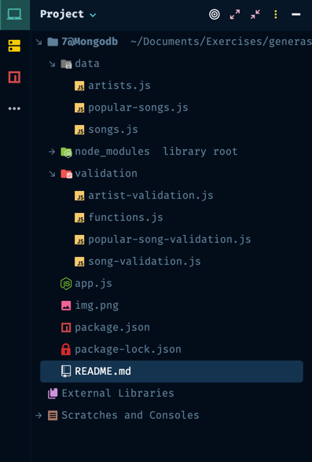
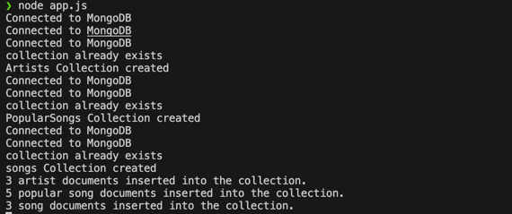

<p align="center">
  <a href="" rel="noopener">
 </a>
</p>

<h3 align="center">mongodb-spotify</h3>

<div align="center">

[]()
[](/LICENSE)

</div>

---

<p align="center"> Few lines describing your project.
    <br> 
</p>

## 📝 Table of Contents

- [About](#about)
- [Getting Started](#getting_started)
- [Deployment](#deployment)
- [Usage](#usage)
- [Authors](#authors)
- [Acknowledgments](#acknowledgement)

## 🧐 About <a name = "about"></a>

A Spotify MongoDB Project with schema validation include

## 🏁 Getting Started <a name = "getting_started"></a>

These instructions will get you a copy of the project up and running on your local machine for development 

### Installing


```
npm install
```

### Project Structure 



## 🎈  Usage <a name="usage"></a>

``` 
node app.js
```




## ✍️ Authors <a name = "authors"></a>

- [@ihsan606](https://github.com/ihsan606) - Idea & Initial work


## 🎉 Acknowledgements <a name = "acknowledgement"></a>

- References
  https://www.youtube.com/watch?v=DdvhZj7SsEM
